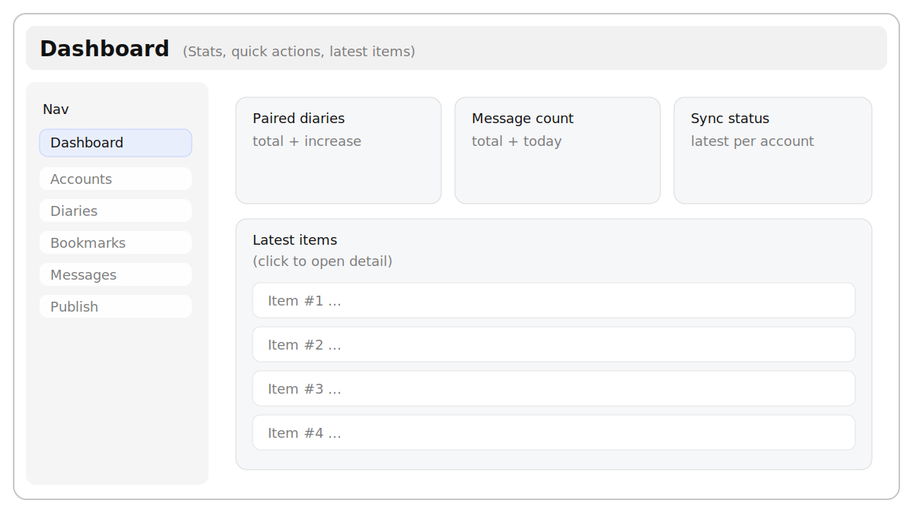
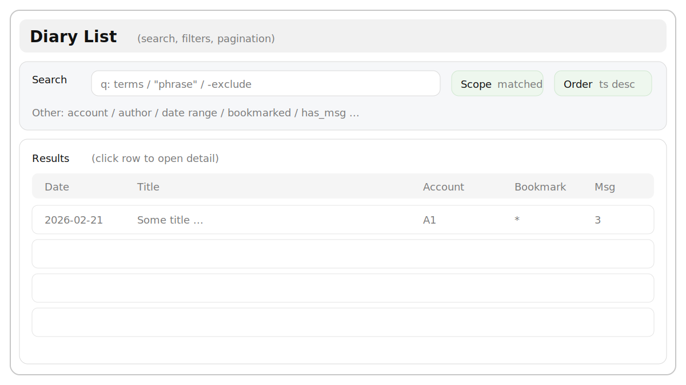
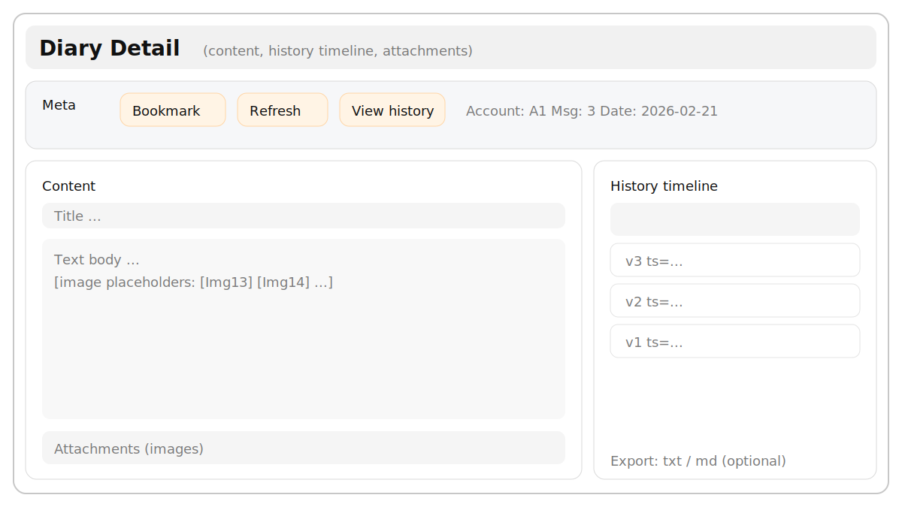
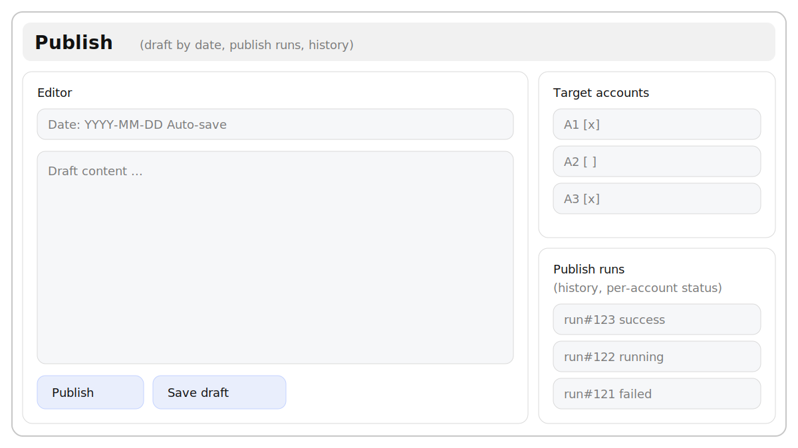

# YourNote

YourNote 是一个本地化的“日记采集 + 多账号同步 + 写作发布”工具，前后端分离：

- 后端：FastAPI + SQLAlchemy（异步）+ APScheduler
- 前端：React + Vite + Ant Design
- 数据库：默认 SQLite（可切 PostgreSQL）

相关文档：

- 后端说明与 API：`backend/README.md`
- 前端说明：`frontend/README.md`
- Docker 部署：`DEPLOY_DOCKER.md`

## 目录

- [功能概览](#功能概览)
- [架构一览](#架构一览)
- [页面预览](#页面预览)
- [快速开始（本地开发，Ubuntu / Linux）](#快速开始本地开发ubuntu--linux)
- [快速开始（Windows）](#快速开始windows)
- [配置](#配置)
- [目录结构（概览）](#目录结构概览)
- [Docker 部署（生产）](#docker-部署生产)
- [GitLab CI/CD（如需）](#gitlab-cicd如需)
- [排错指南](#排错指南)
- [工程规范（重要）](#工程规范重要)
- [开发与自检](#开发与自检)
- [许可证](#许可证)

## 功能概览

以下功能点均来自仓库现有实现（避免 README 误导）：

- 多账号管理：支持用 Token 或账号密码添加账号，并校验/更新 Token
- 同步：支持启动时自动同步、定时同步、手动触发同步；可查看同步日志
- 记录浏览与查询：列表/详情/分页/排序；支持高级查询（含短语与排除词语法）
- 书签/收藏：单条与批量设置/取消书签
- 留言视图：支持过滤“仅有留言/仅无留言”，并按留言数排序
- 记录历史：单条记录的修改历史时间线
- 图片附件：解析正文中的 `[图13]` 占位符，从上游拉取并缓存到本地 DB，前端原位渲染
- 仪表盘统计：配对记录增量、留言增量、最近记录等
- 写作发布：按日期保存草稿，并一键发布/更新到多个账号；发布历史可追踪
- 站点级访问门禁（可选）：未登录时所有 `/api/**` 返回 401；登录后写入 HttpOnly Cookie

说明：本项目的“记录（Diary）”主要来自上游同步，后端不提供传统意义的“本地新建/编辑/删除 diary CRUD”。本地写入能力主要集中在“书签”和“写作发布（publish）”。

## 架构一览

开发模式（本地开发）：

```text
Browser
  |
  |  http://localhost:${FRONTEND_PORT:-31011}
  v
Vite Dev Server (frontend)
  |
  |  /api/*  (by API_PREFIX, via Vite proxy)
  v
FastAPI (backend)
  |
  |  SQLite (SQLITE_DB_PATH) or PostgreSQL (DATABASE_URL)
  v
Database
```

生产模式（Docker Compose，前端 Nginx 同源反代）：

```text
Browser
  |
  |  http://<HOST>:${FRONTEND_PORT:-31011}
  v
Nginx (frontend container)
  |\
  | \__ serve static (SPA)
  |
  \__ /api/*, /docs, /openapi.json, /health  ->  backend:31012
                                         |
                                         |  SQLite: host ./data  -> container /app/data
                                         |  Logs:   host ./logs  -> container /app/logs
                                         v
                                       Database
```

说明：

- 后端与前端开发态都会优先读取仓库根目录的 `.env`。
- 生产态推荐走同源（Nginx 反代）链路，这样浏览器侧不需要额外配置 CORS。

## 页面预览

以下为“页面示意图”（便于快速理解信息架构）。你可以把 `docs/screenshots/*.svg` 替换为真实截图（PNG/JPG）以获得更直观的效果。

### 仪表盘



### 记录列表



### 记录详情



### 发布记录



## 快速开始（本地开发，Ubuntu / Linux）

### 0) 前置条件

- Python：仓库根目录 `.python-version` 为 `3.13`（`pyproject.toml` 要求 `>=3.13`）
- Python 包管理：推荐 `uv`
- Node.js：用于运行前端（建议 Node.js 18+；Docker 构建使用 Node 20）

### 1) 安装依赖

后端依赖（仓库根目录执行）：

```bash
uv sync
```

前端依赖：

```bash
cd frontend
npm install
```

### 2) 配置环境变量

本仓库会优先读取**仓库根目录**的 `.env`（即使你在 `backend/` 或 `frontend/` 目录启动）。

```bash
# 如果你本地已经有 .env，请不要覆盖
test -f .env || cp .env.example .env
```

首次启动建议仅关注：端口、数据库、API 前缀、访问门禁开关（见下文“配置”）。

### 3) 初始化数据库

```bash
cd backend
uv run python init_db.py
```

### 4) 启动项目

方式 A：一键启动（推荐，Linux）

```bash
chmod +x run.sh stop.sh
./run.sh
```

停止（另开终端执行）：

```bash
./stop.sh
```

方式 B：手动启动（开发更可控）

```bash
# 终端 A：后端
cd backend
uv run python run.py

# 终端 B：前端
cd frontend
npm run dev
```

启动后默认访问：

- 前端：`http://localhost:${FRONTEND_PORT:-31011}`
- 后端：`http://localhost:${BACKEND_PORT:-31012}`（Swagger：`/docs`，ReDoc：`/redoc`）

## 快速开始（Windows）

仓库根目录提供 Windows 的一键脚本：

```bat
run.bat
```

停止：

```bat
stop.bat
```

同样建议先完成：`uv sync`、`cd frontend && npm install`、复制 `.env.example` 到 `.env`。

## 配置

配置文件：

- 示例：`.env.example`
- 本地实际：`.env`（不要提交到仓库）

### 常用环境变量（最常用/最容易踩坑）

| 变量名 | 默认值（示例） | 用途 |
|---|---:|---|
| `FRONTEND_PORT` | `31011` | 前端开发服务端口（Vite dev server）；Docker 部署时也用于把前端 Nginx 映射到宿主机端口 |
| `BACKEND_HOST` | `0.0.0.0` | 后端监听地址（开发/容器内监听所有网卡） |
| `BACKEND_PORT` | `31012` | 后端端口 |
| `API_PREFIX` | `/api` | 后端路由前缀；前端 dev proxy 也会按该前缀转发 |
| `SQLITE_DB_PATH` | `./yournote.db` | SQLite DB 路径（相对路径以仓库根目录为基准） |
| `DATABASE_URL` | (空) | 高级用法：直接指定完整 DB 连接串（会覆盖 `SQLITE_DB_PATH`，可切到 PostgreSQL） |

### 访问门禁（站点级访问密码）

用途：未登录时所有 `/api/**` 返回 401；登录成功后写入 HttpOnly Cookie（默认 90 天）。

常用变量：

- `ISPWD=true/false`：是否启用门禁
- `PWD=<明文密码>`：最简单方式（适合本地工具）
- `ACCESS_PASSWORD_HASH=<pbkdf2_sha256$...>`：推荐方式（避免明文）

安全提示：

- 不要把真实密码/Token 写进 README，也不要提交 `.env`
- 部署到公网建议显式配置随机的 `ACCESS_SESSION_SECRET`
- 前端的 `VITE_*` 环境变量会进入浏览器端 bundle，请勿在其中放任何敏感信息

### 同步与上游容错

- `SYNC_ON_STARTUP`：启动时是否后台触发一次全账号同步
- `SYNC_INTERVAL_MINUTES`：定时同步间隔
- `NIDERIJI_HTTP_MAX_ATTEMPTS` 等：上游请求容错重试（详见 `.env.example`）

### 图片缓存

用于将正文中的 `[图13]` 等图片占位符拉取并缓存到本地 DB，前端用稳定 URL 展示。

- `IMAGE_CACHE_ENABLED`：是否启用
- `IMAGE_CACHE_PREFETCH_ON_SYNC`：同步结束后是否后台预拉取
- `IMAGE_CACHE_MAX_SIZE_BYTES`：单图大小上限

### 访问日志（按天落盘）

- `ACCESS_LOG_ENABLED`：是否启用
- `ACCESS_LOG_DIR`：日志目录（相对路径以仓库根为基准，默认 `logs/`）
- `ACCESS_LOG_INCLUDE_QUERY`：是否记录 query（建议默认 `false`，避免意外写入敏感参数）

## 目录结构（概览）

```text
backend/            后端工程（FastAPI）
  app/              业务代码（api/models/schemas/services/...）
frontend/           前端工程（React + Vite）
data/               Docker 部署时的 SQLite 持久化目录（宿主机）
logs/               访问日志（按天落盘；Docker 部署也会挂载）
docker-compose.yml  Docker Compose（frontend + backend）
run.sh/stop.sh      Linux 一键启动/停止（开发用）
run.bat/stop.bat    Windows 一键启动/停止
```

## Docker 部署（生产）

本项目提供 `docker-compose.yml`，默认使用 SQLite（不包含 PostgreSQL 容器）。

```bash
test -f .env || cp .env.example .env
docker compose up -d --build
```

访问方式：

- 前端：`http://<服务器IP>:${FRONTEND_PORT:-31011}`
- 后端接口：同源反代为 `/api/*`
- 后端文档：`/docs`、`/redoc`

数据与日志持久化：

- SQLite 默认落在宿主机 `./data/yournote.db`
- 访问日志落在宿主机 `./logs/`

详细步骤与“IPv4/IPv6 域名解析坑”排障：`DEPLOY_DOCKER.md`

## GitLab CI/CD（如需）

仓库包含 `.gitlab-ci.yml` 的自动部署 job：

- 仅对 `main` 分支触发部署
- 通过 `rsync` 同步代码到服务器的 `DEPLOY_DIR`（会排除 `.env`/`data/`/`logs/`，避免覆盖配置与持久化数据）
- 在目标机执行 `docker compose up -d --build --remove-orphans`

注意：该部署要求服务器部署目录下**已存在** `.env`（流水线不会自动创建/覆盖）。

## 排错指南

### 1) 访问 API 返回 401（`ACCESS_REQUIRED`）

这是访问门禁生效的正常现象：

- 先访问前端页面，会被引导到 `/access` 输入访问密码
- 或临时在 `.env` 设置 `ISPWD=false` 关闭门禁（仅限你确认安全的环境）

### 2) 前端能打开，但接口报错 / 代理不通

常见原因：`API_PREFIX` 不一致。

- 后端路由前缀由 `.env` 的 `API_PREFIX` 决定
- 前端开发态 Vite proxy 也按 `API_PREFIX` 代理
- 前端运行时默认同源 `/api`（可用 `VITE_API_BASE_URL` 覆盖）

结论：如果你修改了 `API_PREFIX`，请同步调整前端（参考 `frontend/README.md`）。

### 3) 开发时把 `BACKEND_HOST=0.0.0.0` 作为代理目标导致连接失败

`0.0.0.0/::` 通常只用于“监听所有网卡”，不适合作为客户端连接目标。

- 解决方式：在 `.env` 设置 `BACKEND_PROXY_HOST=127.0.0.1`

### 4) Docker 部署后数据不见了

请确认：

- 使用的是仓库根目录的 `docker-compose.yml`
- 宿主机 `./data`、`./logs` 目录权限正常（compose 会将其挂载到容器）

## 工程规范（重要）

- 全仓库文本文件统一 UTF-8（无 BOM）
- 统一行尾：默认 LF；`*.bat`/`*.cmd` 使用 CRLF

## 开发与自检

后端（示例）：

```bash
uv run python -m unittest -v
```

前端：

```bash
cd frontend
npm run lint
npm run build
```

前端 e2e（可选）：

```bash
cd frontend
npm run test:e2e
```

## 许可证

本仓库当前未提供 `LICENSE` 文件，如需开源/授权条款请补充后再对外发布。
